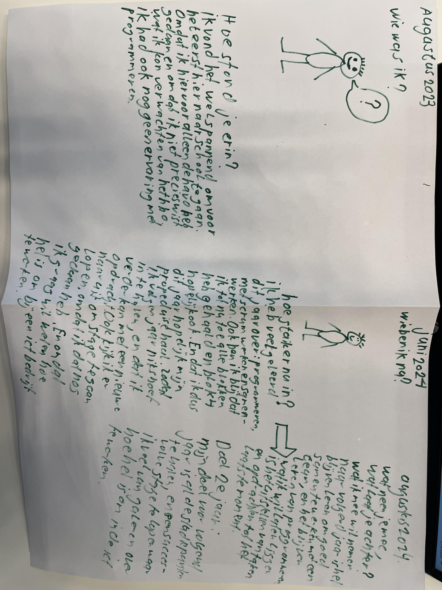

Individuele retrospective
Siem Baltus
   
Augustus 2023
Hoe stond je erin?
Ik vond het wel spannend om voor het eerst hier naar school te gaan. Omdat ik hiervoor alleen de have heb gedaan en omdat ik niet precies wist wat ik kon verwachten van het hbo. Ik had ook nog geen ervaring met programmeren.
Juni 2024
Hoe sta ik er nu in? 
Ik heb veel geleerd dit jaar over: programmeren, met scrum werken en samenwerken. Ook ben ik blij dat ik tot nu toe alle blokken heb gehaald en blok 4 hopelijk ook. En dat ik dus dit jaar hopelijk ook mijn propeduise haal. Zodat ik volgend jaar niks hoef in te halen, en dat ik verder kan met een nieuwe opdracht. Ook kijk ik er naar uit om stage te gaan lopen, omdat ik dat nog nooit gedaan heb. En omdat ik graag wil weten hoe het is om bij een ict bedrijf te werken.

Augustus 2024
Wat neem je mee? 
Wat laat je achter?
Wat ik mee wil nemen naar volgend jaar is het blijven leren om goed samen te werken met een team, en het blijven leren van het programmeren. Wat ik wil laten liggen is het uitstellen van taken en opdrachten tot het laatste moment.

Doel 2e jaar:
Mijn doel voor volgend jaar is al de studiepunten te halen, en een succesvolle stage te lopen waar ik veel van ga leren over hoe het is om in de ict te werken.

